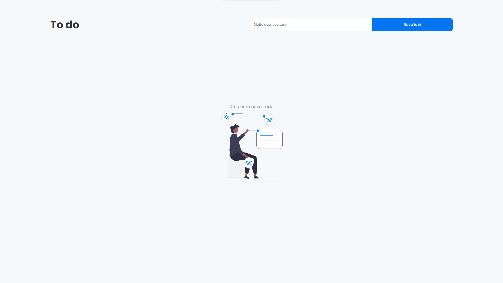

<h1 align="center">
  <strong>To-do List</strong>
</h1>
<br>

## Sobre o projeto - About the project

Este é um app de to-do simples desenvolvido com Next e utilizando conceitos básicos do hook useState.

This is a simple to-do app built with Next and using the basics of the useState hook.


<h1 align="center" display="flex">
   
</h1>

## :computer: Tecnologias - Technologies 

Este projeto foi desenvolvido com as seguintes tecnologias:
<br>
This project was developed with the following technologies:

- [Next](https://nextjs.org/)
- [TypeScript](https://www.typescriptlang.org/)
- [Styled-components](https://styled-components.com/)
- [useState](https://pt-br.reactjs.org/docs/hooks-reference.html)
  <br>

## Como executar - How to execute
Para iniciá-lo, siga as etapas abaixo:
<br>
To start it, follow the steps below:

```bash
# Instale as dependencias
# Install dependencies
$ yarn

# Inicie o projeto
# start the project
$ yarn start
```
O aplicativo estará disponível em seu navegador no endereço http://localhost:3000.
<br>
The app will be available in your browser at the address http://localhost:3000.

<br>
